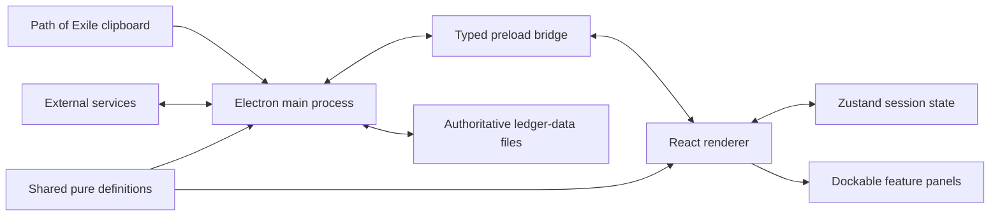

# WraeclastLedger architecture

This is the stable public overview of how the desktop client is structured. It
intentionally excludes private deployment details, credentials, live league
names, and release-specific revision numbers. The repository's internal agent
documents contain the detailed maintenance rules and are authoritative if this
overview ever conflicts with them.

## Runtime boundaries

WraeclastLedger is an Electron application with four code boundaries:

| Boundary | Responsibility |
|---|---|
| `src/main` | Electron lifecycle, privileged operating-system access, clipboard polling, external HTTP requests, updates, and browser/window actions |
| `src/preload` | Small typed bridge exposing approved main-process operations to the renderer |
| `src/renderer` | React interface, dockable panels, application state, parsing, calculations, imports, and presentation |
| `src/shared` | Pure definitions used by both main and renderer bundles, including map-mod tokens, brick definitions, and game-data types |

The renderer does not call privileged Electron APIs or cross-origin economy
services directly. It requests those operations through the preload bridge.

## Renderer organization

- `main.tsx` blocks editing until the file repository has hydrated; `App.tsx`
  owns the FlexLayout model and sends acknowledged layout saves through the
  repository bridge.
- `layout/` maps persisted panel identifiers to React modules and defines the
  default dock arrangement.
- `modules/` contains the major panels: Sessions, Map Log, Investment, Atlas
  Calc, Atlas Tree, Regex, Strategy Browser, Dashboard, Notes, and the optional
  local Run Statistics panel.
- `components/` contains reusable dialogs, strategy presentation, onboarding,
  and shared controls.
- `store/` contains the Zustand session and UI stores.
- `utils/` contains parsers, calculations, formatters, compatibility logic,
  game-data loading, and other testable domain behavior.
- `types/` contains renderer-facing session, map, loot, and strategy shapes.

Panels subscribe only to the store fields they render. Pure calculations and
protocol parsing live outside React components so they can be tested and reused.

## Core data flows

### Map capture

1. The user enables Capture.
2. The main process watches for clipboard changes and sends text through IPC.
3. The renderer parses valid Path of Exile map text into structured map data,
   including optional Delirious percentage and ordered/repeated reward tracks.
4. The session store appends the map.
5. Map Log, Atlas Calc, Regex, Dashboard, and session metrics derive their views
   from the same stored data.

Manual paste uses the same parser but bypasses background clipboard polling.
Map Log keeps Delirium metadata inline beneath the map name in compact panels
and moves it to a dedicated column when the measured panel width permits.

### Investment and profit

Investment settings describe per-map costs such as scarabs, chisels, delirium
orbs, and other strategy inputs. Loot snapshots are imported from CSV as a
baseline and return. Pure utilities combine maps, investment, loot difference,
and the session's divine price into the values shown by Dashboard, comparisons,
and strategy exports. Profit and Atlas-multiplier formulas have one shared
implementation rather than component-local copies.

Shared loot evidence is immutable per authored run. Inventory movement and
Baseline-to-Return market revaluation are distinct accounting components, and
manual supplemental rows remain disclosed. Historical runs retain their
authored prices and divine snapshot; pooled views aggregate those snapshots
without substituting current market prices.

For purchased pre-delirious maps, the purchase price remains the ordinary base
map cost. Captured Delirium level/reward metadata is observation, not evidence
that the author applied or paid for Delirium Orbs.

### Game data

The client ships with a validated bundled manifest as its always-available
baseline. It can adopt a compatible newer manifest from the strategy service
without requiring a desktop release. Derived selectors turn that manifest into
the currently usable scarab, chisel, orb, and mechanic views while preserving
old identities for historical sessions.

### Community strategies

The desktop client creates a bounded, versioned compact submission and can parse
the bot's canonical readable card back into an import preview. Discord is the
write path for community strategies: the bot validates either the compact or
legacy form, persists it in the service database, and posts the readable
community card plus bounded loot evidence. The desktop Strategy Browser reads
the public API; it is not a direct database writer. End-of-league public boards
read immutable server snapshots while Personal retrospectives remain local.
Client, bot, API, fixtures, and compatibility tests move together when the
compact tuple or canonical text wire changes.

## Persistence

The main process owns an authoritative local repository beneath the Electron
profile's `ledger-data` directory. Named session IDs are durable UUIDs and map
to SHA-256 directory names rather than becoming paths. Session, working,
preferences, workflow, and layout records use a framed integrity header plus an
exact JSON body. Commits are generation-checked, hash-verified, serialized, and
rotate a valid `current.wlrec` to `current.bak`; the catalog and human-readable
`INDEX.txt` can be rebuilt from those records.

The renderer keeps only the active payload and repository summaries in Zustand.
It lazy-loads full payloads for navigation, comparisons, and aggregate local
statistics, and reports `Auto-saved` only after the main process acknowledges
the filesystem commit. One shared, exact session-payload contract defines every
persisted session field; the renderer codec, portable import/export, legacy
migration, inspection loading, and meaningful-working classifier are exhaustive
over that contract. Browser `localStorage` is a one-time legacy migration source,
not a second writer. Migration retains exact source backups and removes the old
keys only after a second semantic verification of the completed file repository.
Bootstrap falls back from a persisted target only for a missing record or an
explicit repository recovery condition; permission and unexpected I/O failures
remain loud and do not rewrite workflow pointers.

Batch imports are journaled and either commit in full or roll back. Replaced
meaningful working drafts and deleted named sessions move to recoverable trash
before workflow pointers change. If a later step fails, recovery metadata is
removed only after the reverse rename has restored the authoritative source;
failed rollback therefore leaves a self-describing recovery entry. Abandoned
pre-journal imports are moved out of the active transaction namespace so later
bootstraps do not repeatedly process them. The first edit after opening an
existing session durably checkpoints its opening payload and exposes Undo only
after that write is acknowledged. Version history also records destructive,
pre-restore, and coarse periodic recovery points; restore preserves current
before making a selected version current. Checkpoint identity includes the
editing activation, reason, opening-payload hash, and resulting-payload hash, so
reusing the same opening payload for a different later edit cannot reuse stale
transition details. New checkpoints include bounded collapsible summaries for
selected field-level changes, including exact before/after prices; Note content
is not copied into the diff, and older checkpoints without details remain
readable. Count and compressed-byte limits prune optional history before
protected recovery promises. The explicit
fresh-empty working slot is infrastructure and never enters history or trash;
semantically empty autosaves preserve its marker across automatic league,
divine-price/provenance, and seeded Atlas metadata, while the first meaningful
user edit clears it. Before replacing an older unmarked working slot, the
renderer may adopt the marker only after a closed-shape classifier proves its
payload empty and the adoption save is acknowledged. Automatic metadata and
exclusions exactly matching the current global default preset are not authored
work; unknown fields or malformed values fail safe as meaningful and remain
recoverable. Nullable deselection from the controlled session picker is not
navigation: an explicit New Session row submission creates a working session,
including when that row is already selected. Every replacement transition,
including Strategy Browser build loading while a historical session is visible,
inspects the authoritative repository working target rather than the viewed
renderer payload. Meaningful unprotected work must be named or deliberately
moved to Recently Deleted before replacement; naming a hidden working target
preserves that exact payload without changing the historical view.
Recently Deleted states its
expiry and supports restore or explicit permanent deletion; an identity
collision restores under a fresh UUID so both sessions survive. Restore returns
a named session to Saved sessions as Historical rather than silently changing
the live capture target.

The repository also has an independent single-writer lock. Window close, app
quit, and updater restart request a final flush; a delayed or failed save offers
waiting, retry, pending-state export, or an explicit force exit. The optional
strategy service remains for community sharing, not ordinary session storage.

Explicit Run Statistics counters are stored with the local session. Starfall,
Svalinn, Wildwood, named Atlas anomalies, and selected Mercenary archetypes are
shown against the session's Map Log denominator; Mercenary attributes and Great
House are reference data rather than user-entered labels. The read-only All
sessions view replaces the active saved snapshot with its live state, then sums
each outcome only across sessions that explicitly reported it, so missing values
are not treated as zero and the active run is not counted twice. Named valuable-
beast gains are derived per run from Baseline-to-Return item quantities before
being combined. Atlas/scarab estimates remain per-session because setups can
differ between runs. The optional panel starts with independently collapsed
Kalguuran, Wildwood, Anomalies, Beasts, and Mercenaries sections; Svalinn is
nested as a Starfall Crater outcome. Its panel-level and Bestiary-prerequisite
notices can be dismissed per saved session without becoming authored statistic
data. Neither source is inferred from clipboard text or enters the community
strategy wire.

The same local surface owns an optional per-session manual stopwatch. Its
accumulated interval, running transition, bounded heartbeat, and conservative
interruption recovery are part of the exact session payload; ordinary close,
suspend, lock, and live-target changes pause it before the relevant transition.
Clipboard-derived map timestamps remain the automatic Share-time source and
manual time is substituted only by an explicit user action. A separate
frameless always-on-top companion window may display the timer and selected raw
counters, but it never opens a second repository runtime: the main renderer
relays a bounded snapshot and receives bounded actions over IPC. Overlay layout,
mode, opacity, lock/click-through state, selected counters, and optional global
accelerators are repository preferences rather than session evidence.

Delirium map enchants are additive `MapData` fields. Their reward array preserves
clipboard order and duplicates and survives saved-session round trips. Shares
carry only a bounded aggregate: sampled-map count, Delirium-level distribution,
and reward-track totals. This remains separate from configured Orb type/count/
price, is visible on Strategy Browser cards, and is not part of setup identity.
Compact submission schema v3 appends that aggregate; v2 remains readable.

## External boundaries

- **poe.ninja + official PoE CDN:** league detection, economy context, divine
  pricing, exact item art, and a bounded generic Blueprint fallback.
- **Path of Exile trade website:** pre-filled map searches and trade metadata.
- **Path of Pathing:** embedded Atlas tree planning and allocated-stat reading.
- **WraeclastLedger strategy service:** public strategy reads and versioned game
  data; Discord remains the strategy write path.
- **WealthyExile exports:** user-supplied loot CSV input; no live integration.

Failures are designed to degrade locally where possible: names and calculations
do not depend on artwork, bundled game data remains available offline, and a
missing community service does not prevent ordinary session tracking.

## Verification and release

Pure domain behavior is covered by Vitest. TypeScript checks the Electron and
renderer projects separately, and ESLint is part of the release gate. The
production renderer and Electron bundles are built with electron-vite; Windows
installers and updates are packaged with electron-builder.

Every release must pass typecheck, tests, and lint before packaging. User-facing
changes are recorded in the in-app changelog.
