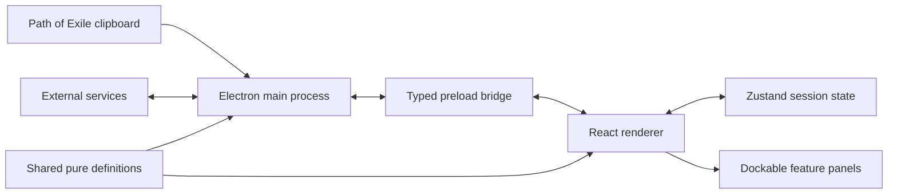

# WraeclastLedger architecture

This is the stable public overview of how the desktop client is structured. It
intentionally excludes private deployment details, credentials, live league
names, and release-specific revision numbers. The repository's internal agent
documents contain the detailed maintenance rules and are authoritative if this
overview ever conflicts with them.

## Runtime boundaries

WraeclastLedger is an Electron application with four code boundaries:

| Boundary | Responsibility |
|---|---|
| `src/main` | Electron lifecycle, privileged operating-system access, clipboard polling, external HTTP requests, updates, and browser/window actions |
| `src/preload` | Small typed bridge exposing approved main-process operations to the renderer |
| `src/renderer` | React interface, dockable panels, application state, parsing, calculations, imports, and presentation |
| `src/shared` | Pure definitions used by both main and renderer bundles, including map-mod tokens, brick definitions, and game-data types |

The renderer does not call privileged Electron APIs or cross-origin economy
services directly. It requests those operations through the preload bridge.

## Renderer organization

- `App.tsx` owns application bootstrap, the FlexLayout model, panel persistence,
  and cross-process lifecycle wiring.
- `layout/` maps persisted panel identifiers to React modules and defines the
  default dock arrangement.
- `modules/` contains the major panels: Sessions, Map Log, Investment, Atlas
  Calc, Atlas Tree, Regex, Strategy Browser, Dashboard, and Notes.
- `components/` contains reusable dialogs, strategy presentation, onboarding,
  and shared controls.
- `store/` contains the Zustand session and UI stores.
- `utils/` contains parsers, calculations, formatters, compatibility logic,
  game-data loading, and other testable domain behavior.
- `types/` contains renderer-facing session, map, loot, and strategy shapes.

Panels subscribe only to the store fields they render. Pure calculations and
protocol parsing live outside React components so they can be tested and reused.

## Core data flows

### Map capture

1. The user enables Capture.
2. The main process watches for clipboard changes and sends text through IPC.
3. The renderer parses valid Path of Exile map text into structured map data.
4. The session store appends the map.
5. Map Log, Atlas Calc, Regex, Dashboard, and session metrics derive their views
   from the same stored data.

Manual paste uses the same parser but bypasses background clipboard polling.

### Investment and profit

Investment settings describe per-map costs such as scarabs, chisels, delirium
orbs, and other strategy inputs. Loot snapshots are imported from CSV as a
baseline and return. Pure utilities combine maps, investment, loot difference,
and the session's divine price into the values shown by Dashboard, comparisons,
and strategy exports. Profit and Atlas-multiplier formulas have one shared
implementation rather than component-local copies.

Shared loot evidence is immutable per authored run. Inventory movement and
Baseline-to-Return market revaluation are distinct accounting components, and
manual supplemental rows remain disclosed. Historical runs retain their
authored prices and divine snapshot; pooled views aggregate those snapshots
without substituting current market prices.

### Game data

The client ships with a validated bundled manifest as its always-available
baseline. It can adopt a compatible newer manifest from the strategy service
without requiring a desktop release. Derived selectors turn that manifest into
the currently usable scarab, chisel, orb, and mechanic views while preserving
old identities for historical sessions.

### Community strategies

The desktop client creates a bounded, versioned compact submission and can parse
the bot's canonical readable card back into an import preview. Discord is the
write path for community strategies: the bot validates either the compact or
legacy form, persists it in the service database, and posts the readable
community card plus bounded loot evidence. The desktop Strategy Browser reads
the public API; it is not a direct database writer. End-of-league public boards
read immutable server snapshots while Personal retrospectives remain local.
Client, bot, API, fixtures, and compatibility tests move together when the
compact tuple or canonical text wire changes.

## Persistence

The current client persists session state and the dock layout locally. Store
migrations preserve compatible older state, and layout migrations repair known
legacy panel identifiers. Auto-save is local-first; the optional strategy
service is for community sharing, not ordinary session storage.

## External boundaries

- **poe.ninja:** league detection, economy context, divine pricing, and item art.
- **Path of Exile trade website:** pre-filled map searches and trade metadata.
- **Path of Pathing:** embedded Atlas tree planning and allocated-stat reading.
- **WraeclastLedger strategy service:** public strategy reads and versioned game
  data; Discord remains the strategy write path.
- **WealthyExile exports:** user-supplied loot CSV input; no live integration.

Failures are designed to degrade locally where possible: names and calculations
do not depend on artwork, bundled game data remains available offline, and a
missing community service does not prevent ordinary session tracking.

## Verification and release

Pure domain behavior is covered by Vitest. TypeScript checks the Electron and
renderer projects separately, and ESLint is part of the release gate. The
production renderer and Electron bundles are built with electron-vite; Windows
installers and updates are packaged with electron-builder.

Every release must pass typecheck, tests, and lint before packaging. User-facing
changes are recorded in the in-app changelog.
