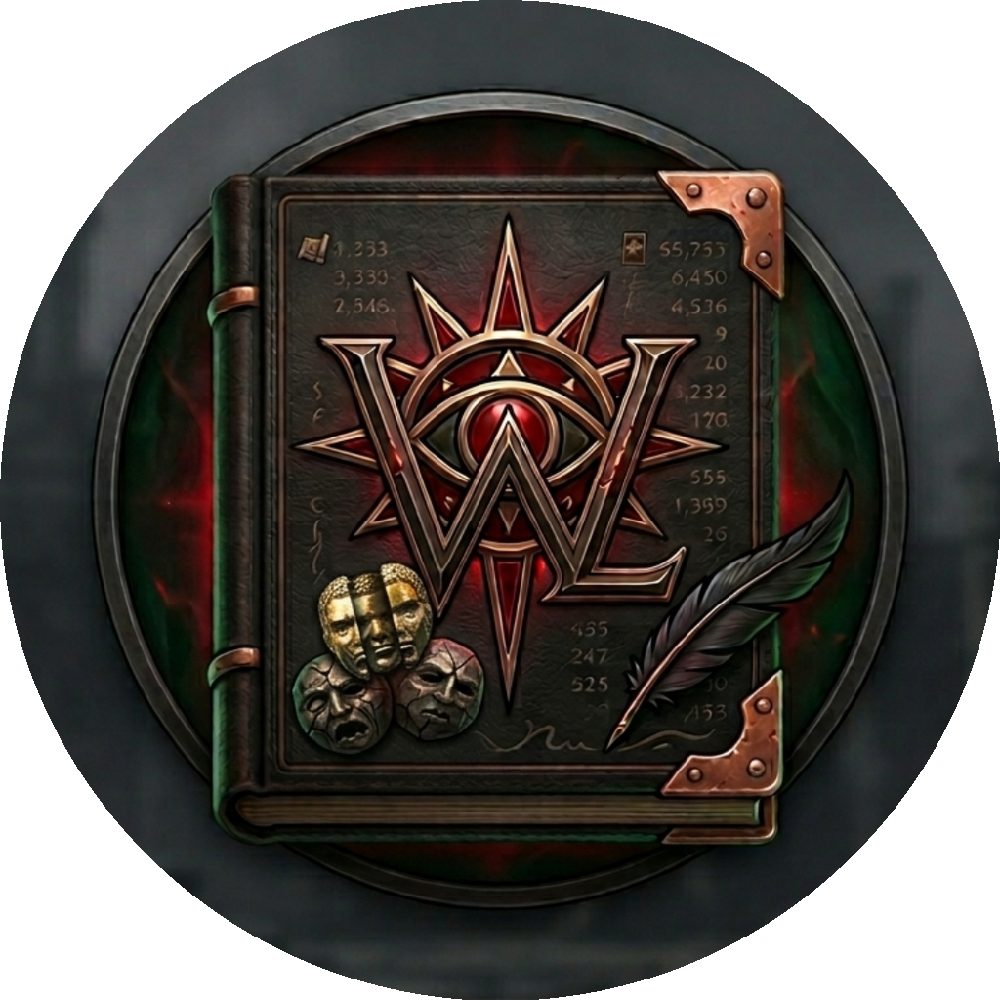

<div align="center">

# WraeclastLedger



**A Path of Exile map-running tracker built with Electron + React + TypeScript.**

Track your session profits, analyse your map stash, generate regex filters, browse community strategies, and search PoE Trade — all in one place.

---

[](https://github.com/gund0lf/wraeclastledger_react/releases/latest)
[](https://github.com/gund0lf/wraeclastledger_react/releases)
[](https://github.com/gund0lf/wraeclastledger_react/releases/latest)
[](https://www.electronjs.org/)
[](https://react.dev/)
[](LICENSE)

</div>

---

## Features

- **Map Log** — Live clipboard capture of map tooltips. Tracks IIQ, IIR, pack size, currency mods, scarabs, delirium orbs.
- **Dashboard** — Session profit overview with investment baseline, loot tracker, per-map averages, and atlas multiplier breakdown.
- **Atlas Calc** — Atlas multiplier calculator with scarab, node, and mounting inputs. Avarice chisel indicator.
- **Investment Module** — Scarab and cost tracking with divine price, per-map cost, and gem leveling offset.
- **Strategy Browser** — Community strategy feed with profit/map estimates, inline divine sub-values, Cost/map column, and Discord export.
- **Regex Module** — Auto-generates stash highlight regex from your session averages. Brick exclusion mod picker, persistent default preset, PoE Trade integration with IIQ/IIR/pack/pseudo stats/delirium/reward type/map type/tier filters.
- **Map Analyzer** — Visual stash grid with quality tier colouring and chisel recommendation. Supports Originator/Uber and regular T16 mod pools. Multi-tab support.
- **Atlas Tree** — Embedded pathofpathing.com atlas planner.
- **Session Manager** — Save, load, import and export sessions. Persistent panel layout.
- **Auto-updater** — Checks GitHub releases on startup.

---

## Download

Head to the [**Releases page**](https://github.com/gund0lf/wraeclastledger_react/releases/latest) and download the latest `.exe` installer.

---

## Project Setup

```bash
npm install
```

### Development

```bash
npm run dev
```

### Build

```bash
# Windows
npm run build:win

# macOS
npm run build:mac

# Linux
npm run build:linux
```

---

## Tech Stack

[](https://www.electronjs.org/)
[](https://react.dev/)
[](https://www.typescriptlang.org/)
[](https://mantine.dev/)
[](https://zustand-demo.pmnd.rs/)
[](https://electron-vite.org/)
