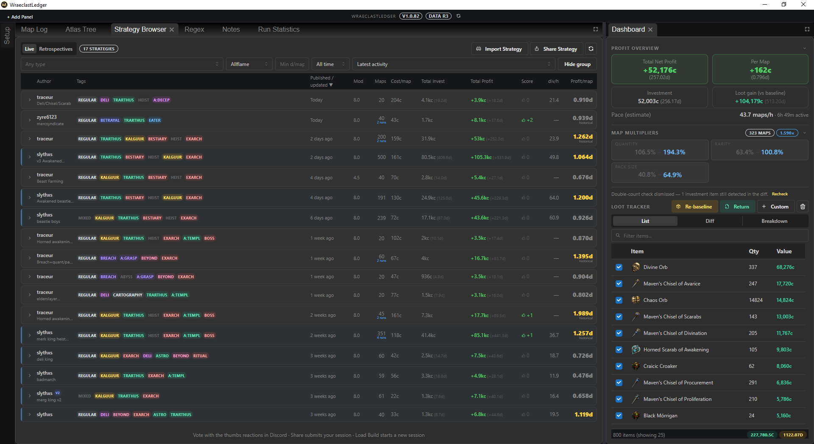
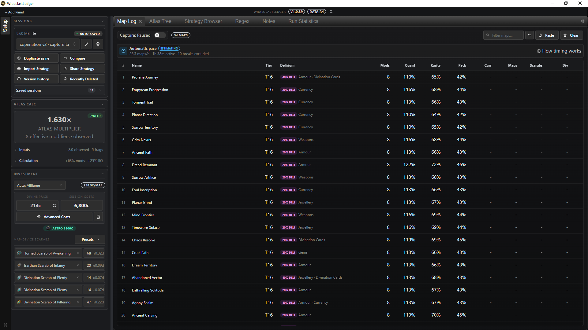
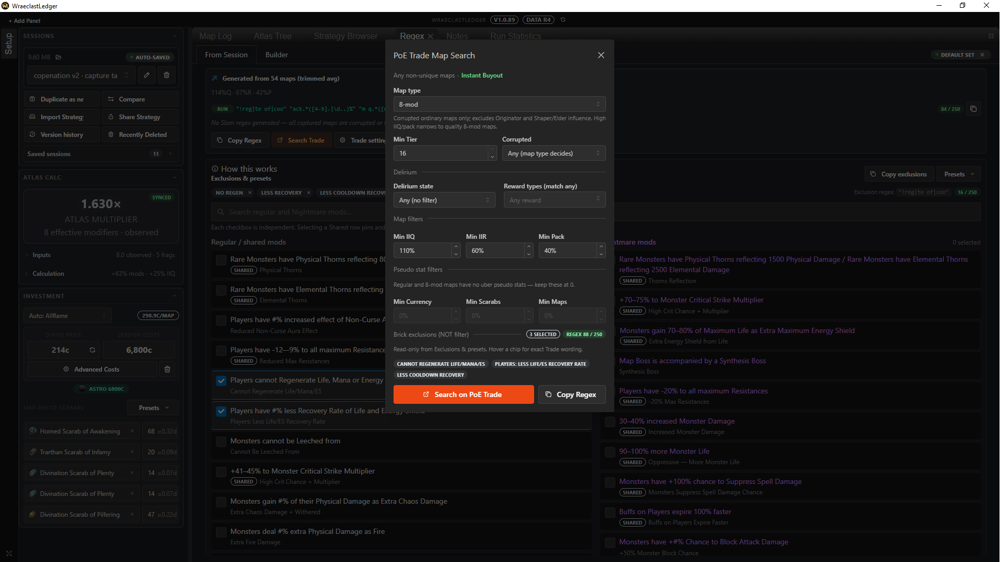

# WraeclastLedger


[](https://github.com/gund0lf/wraeclastledger_react/releases/latest)
[](https://github.com/gund0lf/wraeclastledger_react/releases)
[](https://github.com/gund0lf/wraeclastledger_react/releases/latest)
[](https://www.electronjs.org/)
[](https://react.dev/)
[](https://www.typescriptlang.org/)
[](LICENSE)

A desktop companion app for Path of Exile map farming. Copy a map tooltip in game (Ctrl+C), and it logs the map — IIQ, IIR, pack size, tier, mods. From there it tracks session profit, generates stash-highlight regex, and builds pre-filled trade searches.

Available as a Windows installer and x86_64 Linux AppImage. The Linux capture
and update path is validated on CachyOS with KDE Wayland and Steam Proton. The
AppImage uses XWayland inside a Wayland desktop so Electron can keep the optional
Timer/Counters window above Path of Exile; other distributions and desktop
environments are currently best-effort until tested. See the
[Linux AppImage notes](docs/LINUX.md) for requirements and current limitations.

[**Download the latest release**](https://github.com/gund0lf/wraeclastledger_react/releases/latest)
Free for personal use — see LICENSE



## What's in it

- **Map Log** — captures map tooltips from the clipboard. Filterable table with per-map detail (IIQ/IIR/pack, currency mods, scarabs, Delirious level/reward tracks, div cards).
- **Dashboard** — session profit overview. Imports loot CSVs (currently WealthyExile exports) and shows a categorized breakdown against your baseline, plus per-map averages. Supplemental Custom drops can be entered by total value or value per item while remaining visibly disclosed as manual additions.
- **Investment Module** — per-map cost setup (scarabs, delirium orbs, astrolabe, chisels), a session-bound Divine-price snapshot from poe.ninja with explicit refresh, cost-per-map and net profit.
- **Atlas Calc** — synchronizes supported modifiers from your Path of Pathing tree and combines them with observed map modifiers plus Investment fragments and scarabs. Its source state stays visible when the tree changes, becomes stale, or belongs to another league.
- **Regex** — generates stash regex from captured session thresholds and named Regular/Nightmare brick-mod exclusions. The Builder also supports K-of-N rules ("at least 3 of these 8 mods") and a guided Magic Map workflow with exact stat floors and applied-chisel adjustments. Every copied stash regex enforces the 250-character limit, and the same reviewed filters can open a pre-filled PoE trade search.
- **Strategy Browser** — community-shared farming strategies with cost/profit breakdowns, sortable from the dropdown or table headers by latest activity, cost/map, div/map, profit, community score, and more. Sharing copies a compact submission for Discord; the channel bot validates it, posts a readable card with bounded loot evidence, and adds the strategy to the Browser. Discord reactions become its community score. Optional party size, session time, and atlas-point context can be included, and readable card exports can be pasted back into the app to compare or import a build.
- **Atlas Tree** — embedded [pathofpathing.com](https://pathofpathing.com) planner; applied passives (and point counts, when sharing) feed the calculations.
- **Sessions** — integrity-checked local file auto-save with bounded Version history, contextual Undo, and Recently Deleted recovery. Recorded field changes open by default and can be collapsed; New Session and Strategy Browser build loads ask before replacing meaningful unnamed work, even while you are viewing a historical session. Compare up to six saved sessions side by side, including capture-derived Pace where available, or use portable JSON export/import. The Sessions panel shows save status and repository size and can open the complete local data folder for backup. Panels are draggable and the layout persists there too.
- **Run Statistics (optional)** — an Add Panel-only local tracker for selected Kalguuran, Wildwood, Atlas anomaly, valuable-beast, and Mercenary outcomes. Collapsed headers show count/rate summaries, Session stays editable, and All sessions combines explicitly reported outcomes across saved runs without double-counting the active session. A per-session stopwatch and draggable always-on-top Timer/Counters companion window support pre-imported-map workflows, with optional user-defined shortcuts; clipboard-derived time remains the automatic Share default unless manual time is explicitly selected. None of this is included in shared strategies.

The app auto-updates from GitHub releases. Windows installers and Linux
AppImages are currently unsigned, so install only from this repository's
[official GitHub Releases](https://github.com/gund0lf/wraeclastledger_react/releases).
Update authenticity currently depends on the integrity of the GitHub release
account/channel plus updater metadata checksums; there is no independent
publisher-signature trust root yet.

## More screenshots

### Map capture and session setup



### Regex and trade search



## Development

```bash
npm ci
npm run dev        # dev server with hot reload
npm start          # preview the built app
npm run typecheck  # TypeScript checks for main/preload and renderer
npm test           # Vitest and packaging checks
npm run lint       # ESLint
npm run build      # production build
```

Stack: Electron 43, React 19, TypeScript 5, Mantine v8, Zustand, electron-vite, flexlayout-react.

Client CI runs on branch pushes and pull requests on Windows 2022 and Ubuntu
24.04, using Node 24.20.0 and npm 11.19.0. It installs the committed dependency
lockfile, then runs typecheck, all tests, lint and the production bundle build.
Errors fail the job; existing lint warnings remain visible. These checks use no
release secrets and do not create installers or publish releases. The manual
Linux artifact workflows remain separate.

The Windows release command, `npm run publish:win`, enforces typecheck, the full
test suite and lint before building and uploading with electron-builder. Any
failure stops the sequence; lint warnings remain visible and allowed, while
errors block publication. Run it only for an authorized release with the existing
release credentials. Routine tests verify the command order and failure stops
using an isolated fixture and fake uploader; they do not publish a release.

For process boundaries, data flows, persistence, and integration structure, see
[ARCHITECTURE.md](ARCHITECTURE.md).

---

*WraeclastLedger is a fan-made tool and is not affiliated with or endorsed by Grinding Gear Games.*
